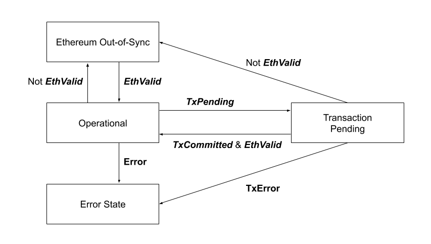
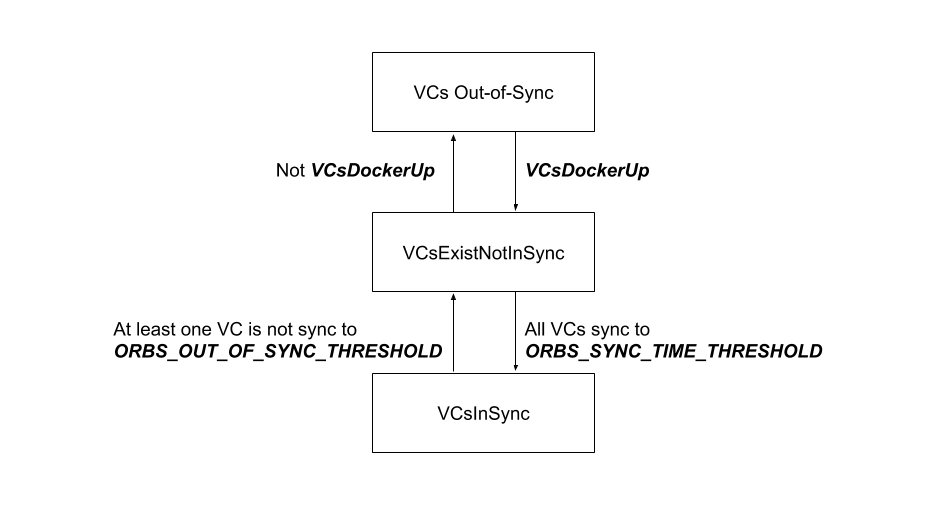

# Ethereum Writer Service

> V2 release

In order for an Orbs node to participate in the Proof-of-Stake process on Ethereum, various Ethereum transactions must be sent routinely. For example, sending an aggregated peer reputation decision to Ethereum to support automatic vote outs. The Ethereum Writer service performs these routine communications with the Orbs Ethereum contracts.

## Ethereum Sync Status State Machine

### States:

* Operational - The service is operational and may send new transactions to Ethereum.
* Ethereum Out-of-Sync - Lost sync with Ethereum. Do not send transactions since events status may be not up to date.
* Error State - The state machine has reached a state that requires service reset to return to operational mode.
* Transaction Pending - A notification transaction was sent and its result is not yet in sync.

### Flags / Arcs:

* EthValid - `now() - Ethereum topBlock.timestamp > ETHEREUM_PROGRESS_REQ` (10 min).

  * Note: The top block time is more suitable for sync check than the reference time. Useful to add to management service also for other functions such as ONG.NodeSync.

* TxPending - Last transaction is pending or `transaction.block time < service2.referenceTime`.

  * Note: Transaction receipt does not actively include time. As management service finality parameter is block based, we can consider to use the block number as reference instead of time.

* TxCommitted - Transaction was successfully committed.

* TxError - The transaction was committed with Error (see Sending Transactions).

* Error:

  * VotedUnready - The Validator was voted as indicated by a `ValidatorStatusUpdated(MyAddress, RFS = FALSE)` event with referenceTime that is later than the validator (ethereum writer) init time measured by the system local time (indicating that the validator was reset after the voteUnready).

  * FailedToSync - The validator was inStandby for more than `FAIL_TO_SYNC_TIMEOUT` (24 hours) and failed to reach VCsInSync state.

## VCs Sync Status State Machine

* VCsDockerUp - All VC dockers are up and ready to start sync (matrix responding).

* VCsInSync - Indicates that all the VC are ready to participate in a committee. Transition in/out:

  * In: All VCs last block was committed within the last `ORBS_SYNC_TIME_THRESHOLD` from the local clock.

  * Out: At least one VC last block was committed over `ORBS_OUT_OF_SYNC_THRESHOLD` time prior to the local clock.

  * `ORBS_SYNC_TIME_THRESHOLD = 5 min`

  * `ORBS_OUT_OF_SYNC_THRESHOLD = 60 min`

* The last committed block time is received in every client request to the VC. It may be taken from runQuery to `_Committee.getAllCommitteeReputations()` that is required for the auto vote-unready.

* Note: VCs query does not need to be done in a timely manner and VCs may be queried in a slow process presenting a non-coherent state (each VC sampled in a different time).

## Ready Notifications

Notifications are sent only in Ethereum Sync Status Operational state. 

### Notify ReadyForSync:

* A node is deployed, not in topology and does not have a non-stale RFS in place.
  
  * `UpdateStale || StandbyAvailable`
  * `VCsExistNotInSync`
  * `NOT (IsStandby || InCommittee)`

* AuditOnly node, in sync that want to keep its position in the standby:

  * `Config.AuditOnly`
  * `UpdateStale`
  * `VCsInSync`
  * `IsStandby`

### Notify ReadyForCommittee:

* A node that the world thinks is not ready for committee, and is now ready: 

  * `Last ValidatorStatusUpdated(MyAddress).RFC = FALSE`
  * `NOT AuditOnly`
  * `VCsInSync`
  * `NOT InCommittee`

* Consensus node refresh - in standby, in sync and stale or can join committee (eg. suddenly enough stake):  

  * `Last ValidatorStatusUpdated(MyAddress).RFC = TRUE`
  * `NOT AuditOnly`
  * `UpdateStale || CanJoinCommittee`
  * `VCsInSync`
  * `IsStandby`

## Committee State

* IsStandby - The validator is in the latest standby.

* InCommittee - The validator is in the latest committee event.

* UpdateStale - Last `ValidatorStatusUpdated(MyAddress, RFS = TRUE).ReferenceTime + STALE_TIMEOUT - REFRESH_WINDOW < Ethereum referenceTime`.

  * `STALE_TIMEOUT = 7 days`
  * `REFRESH_WINDOW = 2 hours`

* StandbyAvailable - One of the validators in the standby list is stale or there are available slots in the standby. Stale validator: `Last ValidatorStatusUpdated(Validator).ReferenceTime + STALE_TIMEOUT < Ethereum referenceTime`.

  * `STALE_TIMEOUT = 7 days`
  * Available slots: `number of members in standby <= MAX_STANDBYS` (5 - can be hardcoded, in the future can be taken from the MaxStandbysChanged event).

* CanJoinCommittee - Every `CAN_JOIN_COMMITTEE_POLL_TIME` (10 minutes) node calls Ethereum query `Elections.canJoinCommittee(myAddress)` and sets the variable to the result.

  * For optimization, can query only when:
    * `Operational`
    * `NOT AuditOnly`
    * `NOT InCommittee`
    * `VCsInSync`

## Auto Vote-Unready

Vote unready is used in order to remove a non-active committee member from the committee. A Validator that was voted unready is removed from both the committee and the standby lists.

The removal of a validator is based its reputation in all virtual chains where the validator is active (certified / general).

Note: Validator that is not a committee member in a virtual chain has a perfect reputation (0) on that chain. Therefore, all the committee members may be monitored on all virtual chains even if they are not in the chain committee (not certified).

Monitoring of the reputation is done by a continuous query of `_Committee.getAllCommitteeReputations()`. 

Ignore the result if VC is not in sync. May be implemented by query only when VCsInSync is set (ie. all VCs in Sync).

Note: Reputation monitoring does not need to be too frequent (even sample every 10 minutes is ok) and the reputation status does not have to be coherent on all virtual chains. The vote unready mechanism on Ethereum allows validators to vote at different times (valid for one week).

The Validator node monitors the behaviour of all other Validators based on their global reputation.

### Sending Vote-Unready:

Conditions to send VoteUnready to ValidatorX:

  * Sender is `Operational`
  * Sender is `VCsInSync AND InCommittee`
    * The validator is in the committee (only committee member votes are counted) and in the validator VCs are in sync.
  * ValidatorX is `InCommittee`
  * ValidatorX has Invalid Reputation for more than `INVALID_REPUTATION_GRACE` (6 hours) on a virtual chain (any of them).
    * See below, notice that reputation is measured on Orbs address.
  * No pending voteUnready on the validator was sent:
    * `[VoteUnreadyTime(ValidatorX) < referenceTime - VOTEOUT_VALIDAITY (7 days)] OR [RFCTime(ValidatorX) > VoteUnreadyTime(validatorX)]`
    * `VoteUnreadyTime(ValidatorX) = last VoteOut(my address, ValidatorX) timestamp`
    * `RFCTime(ValidatorX) = last ValidatorStatusUpdated(ValidatorX, RFC = TRUE)`

### Invalid Reputation

Guardian VC reputation:
  
  * If `last committed_block.timestamp` on the `ORBS_OUT_OF_SYNC_THRESHOLD` (1 hour) then reputation = 0 (perfect reputation). Note: if it simplifies the implementation may use VCInSync.

Invalid reputation: 

  * A validator has invalid reputation in a virtual chain if the Guardian `VC reputation >= INVALID_REPUTATION_THRESHOLD` (4) & `vc_median_reputation <= VALID_REPUTATION_THRESHOLD` (2).

Notes:

* Validator reputation: obtained from `_Committee.getAllCommitteeReputations()`, returns a list of Orbs addresses, missesReputation.
  * MissesReputation: 0 - perfect reputation, 4 (max) - malfunction validator.
* Ethereum writer will vote unready a malfunctioning validator in about 7hrs when the VC closes empty blocks and a little over 6 hrs otherwise (calculated for committee size of 22).
* There is a 0.15% chance of voting unready a malfunctioning validator with an invalid reputation that has since returned to a valid state.
* The tradeoff between network tolerance and falsely kicking out a validator can be tweaked in the future to fulfill new requirements - by lowering\increasing the `INVALID_REPUTATION_GRACE`.

## Gas Price On Transaction Send

One-shot discount algorithm:

* If last transaction committed successfully:
  * Use discount parameters:
    * `Timeout = config` (1 hour)
    * `Gas price = getGasPrice() * discount_factor`
* Else:
  * Use discount parameters:
    * `Timeout = config` (10 min - refresh time)
    * `Gas price = getGasPrice()`

* `getGasPrice()` obtained form the node's Ethereum client using the relevant RPC method.

## VCsInSync - Revised

Indicates that all the nodes’s VCs are ready to participate in a committee.

* VCStuck - the last time (local time) a block was committed - note that this is the time we last wrote to block storage meaning it will update recently when we recently sync a very old block (from sync or consensus) `> ORBS_STUCK_THRESHOLD`.

* VCInSync:
  * Set: `Last committed block timestamp > now() - ORBS_SYNC_TIME_THRESHOLD`
  * Clear: `Last committed block timestamp < now() - ORBS_OUT_OF_SYNC_THRESHOLD`

* VCLive if `local refrenceTime > VC_Genesis refrenceTime + ORBS_SYNC_TIME_THRESHOLD` and not VCStuck.

* VCsInSync if all VCs that are VCLive are InSync.

## Configuration

* Config.AuditOnly - Indicates that the Validator does not desire to join the committee, never sends ReadyForCommittee.
