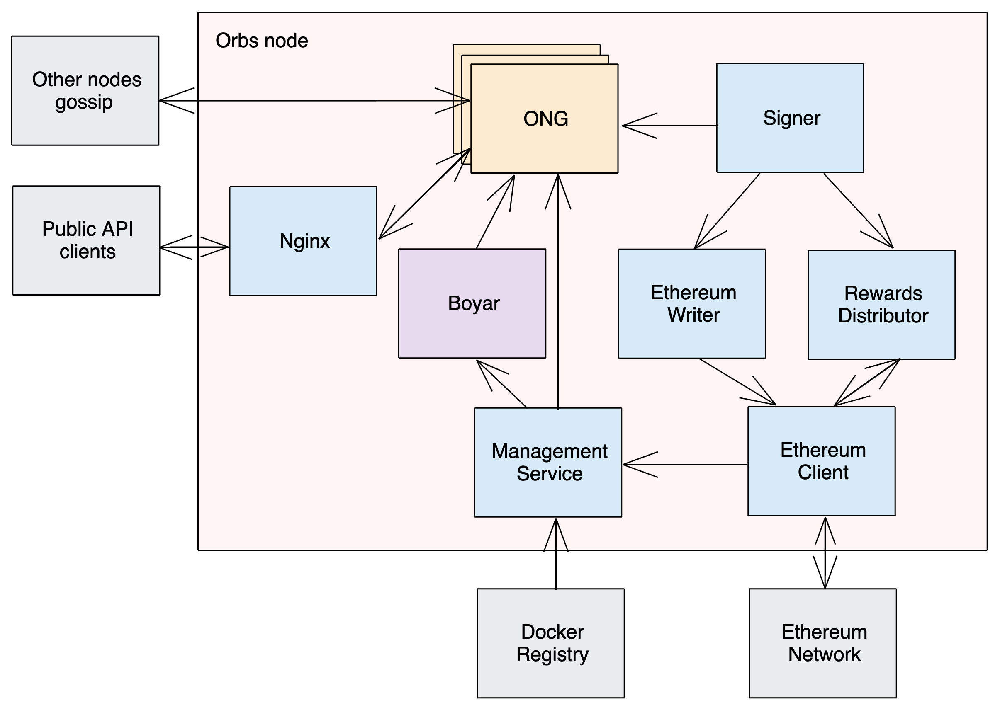

# Node Architecture

> V2 release

## System Overview

&nbsp;

A single Orbs node is built from multiple subsystems and may span multiple physical machines. The diagram above ignores allocation of subsystems/services to physical machines and focuses on which services are part of the node and how data flows between them.

### Boyar

This daemon service is the main orchestrator of the node. This is the first service to run and its purpose is to execute all the other services, provide their launch configuration, upgrade their software version, etc. Boyar relies on [Docker Swarm](https://docs.docker.com/engine/swarm/) to execute all other services as docker containers across all available physical machines and monitor their liveness. Since Boyar instructs Docker Swarm itself, it is running outside of Docker.

Architecture: [BOYAR.md](BOYAR.md)

Source code: https://github.com/orbs-network/boyarin

### ONG (Orbs-network-go)

An Orbs node runs multiple virtual chains side by side. Each virtual chain is an isolated blockchain instance that has its own consensus and blocks. Every virtual chain has an owner paying for its subscription and is normally focused around a specific decentralized app running on top of this virtual chain as a set of smart contracts. Every virtual chain instance runs in its own isolated docker container managed by Boyar.

Architecture: [Virtual Chain (ONG) Architecture](../vchain-architecture/)

Source code: https://github.com/orbs-network/orbs-network-go

### Node Services

Various daemon services are required for an Orbs node to operate. They usually have a single instance that serves the node in its entirety. These services are dockerized and managed by Boyar. These services include:

* **HTTP API gateway** - HTTP server that provides the external [API endpoint](https://www.nginx.com/blog/building-microservices-using-an-api-gateway/) to end-users for virtual chain Public API (eg. a virtual chain end-user trying to perform a transaction or make a query). Proxies the HTTP request to the relevant ONG instance. This is an off-the-shelf HTTP proxy server (Nginx) configured by Boyar to be aligned with the state of the other node services.

    Source code: https://github.com/nginx/nginx

* **Management Service** - Reads ongoing node management configuration from its external source of truth (eg. Ethereum) and serves it to Boyar and ONG instances. Management configuration includes for example: elected committee (which nodes are authorized to validate blocks per VC), subscriptions (which virtual chains should be active), topology (network addresses of all committee and candidate nodes), the list of node services, and their configurations and binary versions.

    Architecture: [MGMT-SERVICE.md](MGMT-SERVICE.md)
    
    Source code: https://github.com/orbs-network/management-service

* **Ethereum Writer** - In order for an Orbs node to participate in the Proof-of-Stake process on Ethereum, various Ethereum transactions must be sent routinely. For example, sending an aggregated peer reputation decision to Ethereum to support automatic vote outs.

    Architecture: [ETH-WRITER.md](ETH-WRITER.md)

    Source code: https://github.com/orbs-network/ethereum-writer

* **Signer** - Manages the node private keys (Orbs and Ethereum) securely and signs transactions on behalf of the node. Used by ONG to sign blocks and protocol messages. Also used by Ethereum Writer to sign Ethereum transactions.

    Source code: https://github.com/orbs-network/signer-service

* **Logs Service** - Simple HTTP server to explose rotating log files written by the various node services/ONG. All log files are written by the services to persistent disk storage in known locations which this service makes available to query.

    Source code: https://github.com/orbs-network/logs-service

* **Ethereum Client** - Since a public Orbs node relies on Ethereum as the source of truth for management configuration, such as elected validators (based on Proof-of-Stake taking place on Ethereum), connection to the Ethereum blockchain is crucial for continuous operation. Many validators rely on an external Ethereum client using a third-party service such as [Infura](https://infura.io/) or [Alchemy](https://alchemyapi.io/).

    Source code: https://github.com/ethereum/go-ethereum

&nbsp;

## Creating a New Node

When running an Orbs node on a cloud service like [AWS](https://aws.amazon.com/), a convenience CLI tool named [Polygon](https://github.com/orbs-network/polygon) can provision all node resources automatically (compute machines, storage, etc). Polygon relies on [Terraform](https://www.terraform.io/) to interact with popular cloud providers. Polygon configures the Boyar daemon and ensures it is launched after boot.

When running an Orbs node on-premise, all resources must be provisioned manually. The Boyar daemon must be configured and launched manually as well.

&nbsp;

## Monitoring and Logging

Logging is a cross-cutting concern of the entire system since each of its parts (Boyar, all ONG instances, all node services) generates its own separate log. In addition, the entire network (all validators) can be monitored using a Status Page backend which can be executed and deployed by anyone.

Architecture: [LOGGING.md](LOGGING.md)

Source code: https://github.com/orbs-network/status-page-v2

&nbsp;

## Ethereum Contracts

Most of the Orbs Proof-of-Stake logic (staking, elections, rewards, subscriptions) is implemented over Ethereum as an independent source of truth, using a set of Solidity smart contracts. Orbs nodes communicate with these smart contracts via Management Service and Ethereum Writer service.

Architecture: [Orbs PoS Architecture](../pos-architecture/)

Source code: https://github.com/orbs-network/orbs-ethereum-contracts-v2