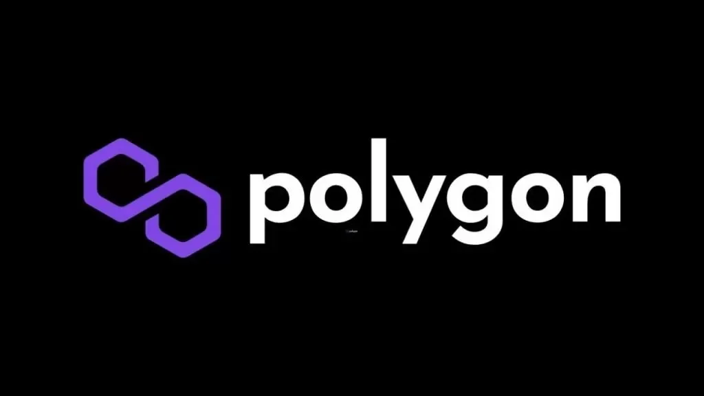

# Orbs PoS Architecture - V2.5 - The Age of Guardians

Orbs V2.5 PoS architecture is responsible for the Proof-of-Stake implementation, from guardian election to participants rewards. The entire election logic, reward calculation and distribution are performed on Ethereum contracts.

## Polygon network support
As of march 29 2022, Orbs network supports both ETH and Polygon networks.

Staking and reward claiming is now cheaper and faster using the L2 Polygon netwrok.

The contratcs deployed on both networks are identical.

staking tool, analytics and orbs status page are all supporting polygon.

### Polygon rewards auto compunding
In Polygon, Stakers and Delegators benifit from autocompounding.
Once a week their rewards will be auto claimed so their staking principal increases.
No action taken from guardians nor delegators.

&nbsp;

#### [PoS V2.5 - Age of Gurdians Overview](./overview.md)

#### [Ethereum Contracts Overview](./contracts.md)

#### [Official Deployed Contract Addresses](https://github.com/orbs-network/posv2-contracts-deployment-migration/blob/master/DEPLOYED_CONTRACTS.md)

#### [Governance and Management Architecture](./management.md)

#### [Contracts Governance Parameters Summary](./parameters.md)

#### [Continuous PoS State Update](./continuous_state_update.md)

#### [Main User Flows](./user_flows.md)

#### [The Certified Committee](./certified_committee.md)

#### [Stake Notation in Orbs PoS Contracts](./stake_notation.md)

#### [Reward Distribution Architecture](./reward_dist_arch.md)

---

For (the deprecated) V1 architecture see: [V1 tag - PoS Architecture](https://github.com/orbs-network/orbs-spec/tree/V1/pos-architecture)
