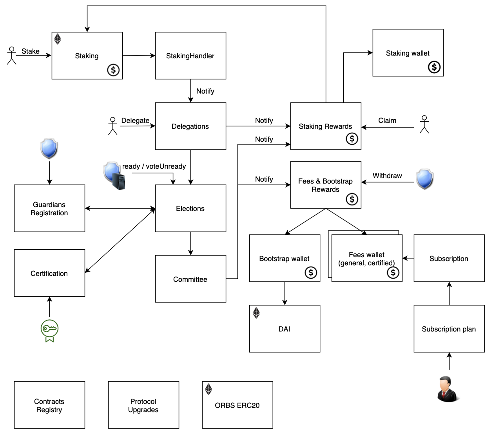

# Orbs PoS Architecture - V2.5 - The Age of Guaridans
Orbs V2.5 PoS architecture is responsible for the Proof-of-Stake implementation, from guardian election to participants rewards. The entire election logic, reward calculation and distribution are performed on Ethereum contracts. 

&nbsp;

#### [PoS V2.5 - Age of Gurdians Overview](https://www.orbs.com/orbs-pos-universe/)

#### [Contracts](./contracts.md)

#### [Governance and Management Architecture](./management.md)

#### [Contracts Governance Parameters Summary](./parameters.md)

#### [Continuous PoS State Update](./continuous_state_update.md)

#### [Main User Flows](./user_flows.md)

#### [The Certificatied Committee](./certified_committee.md)

#### [Stake Notation in Orbs PoS Contracts](./stake_notation.md)

Note: For V1 archietcture see [V1 tag - PoS Archiectture](https://github.com/orbs-network/orbs-spec/tree/V1/pos-architecture)
