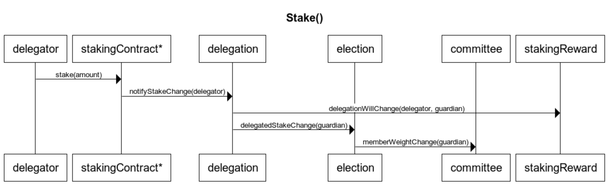
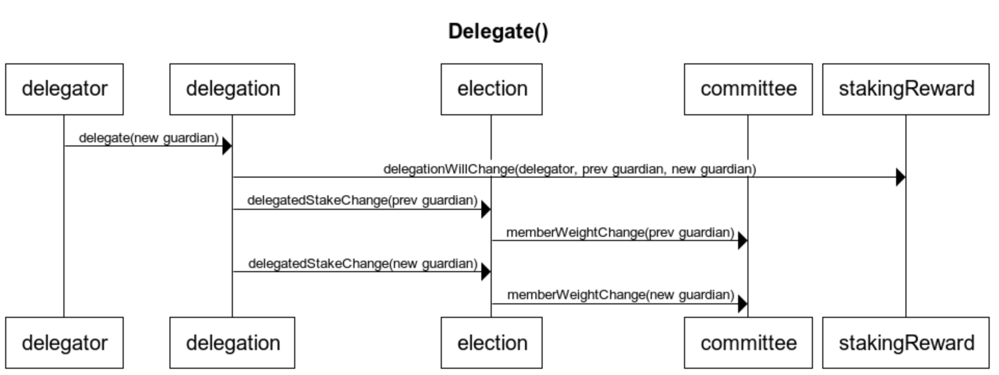
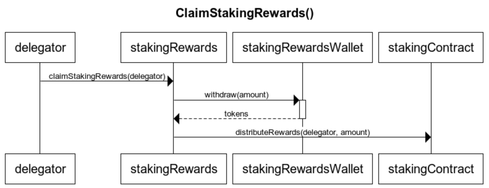
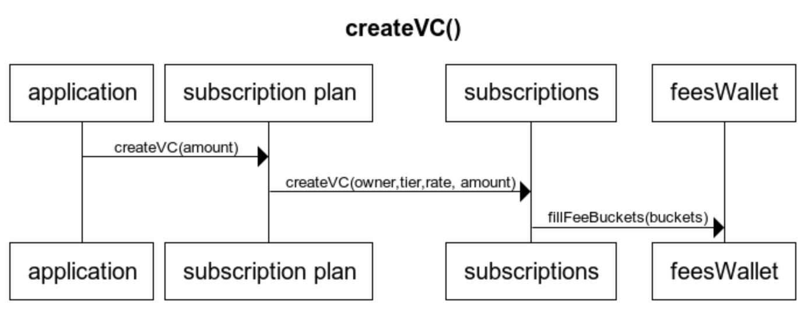

# Main User Flows

&nbsp;
## Stake (Unstake)

Interface: `stakingContract.stake(uint256 _amount)`

* The staking contract forwards the notification to the stakingContractHandler that notifies the delegation contract.

&nbsp;
## Delegate

Interface: `delegation.delegate(address guardian)`

&nbsp;
## Claim Staking Rewards

Interface: `stakingRewards.claimStakingRewards(address addr)`

&nbsp;
## ReadyForCommittee

Interface: `elections.readyForCommittee()`

&nbsp;
## Create Virtual Chain

Interface: `subscription_plan.createVC(name, amount, isCertified, deploymentSubset)`

&nbsp;
## VoteUnready

Interface: `election.voteUnready(address subject)`

A node, even of an honest Guardian, may be temporary down for different reasons. Orbs V2.5 architecture provides means to reduce the impact on the network while the node is down.

Each Virtual chain maintains a reputation value for every committee member. The reputation is calculated and agreed on under consensus, based on a validator performance when elected as leader. When a guardian's reputation goes below a threshold on any of the Virtual chains, it is identified by the other guardians that vote him unready. The vote-unready is performed automatically by sending a transaction to the Election contract. Once enough the voteUnreadyThreshold (default 70% out of the total committee weight) was reached the guardian is removed from the committee.

The committee contract updates the reward contracts on the removal of the guardian and the guardian and his delegators stop receiving rewards. A guardian may rejoin the committee by sending readyForCommittee().

&nbsp;
## VoteOut

Interface: `election.voteOut(address subject)`

When a Guardian shows Byzantine behaviour over time Orbs Proof-of-Stake architecture provides a means for the community to vote him out permanently. The community may choose to permanently vote a Guardian for any behaviour that is agreed as malicious and that deserves to be removed. Once enough the voteOutThreshold (default 70% out of the totalDelegatedStake) was reached the guardian is removed from the committee. A Guardian that was voted out cannot be elected again and the Guardian and his Delegators stop receiving rewards. 
